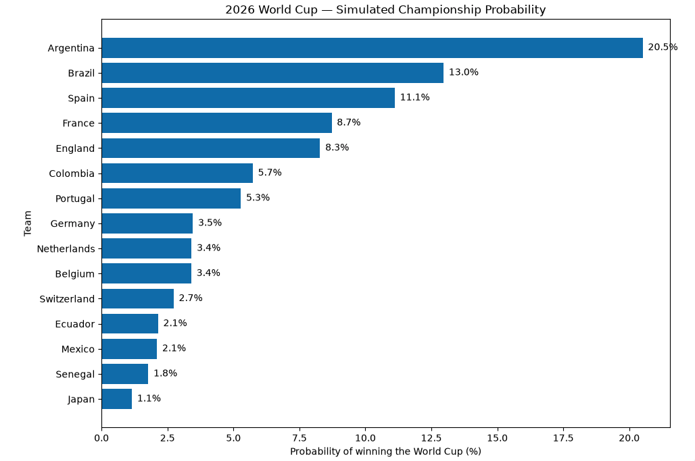
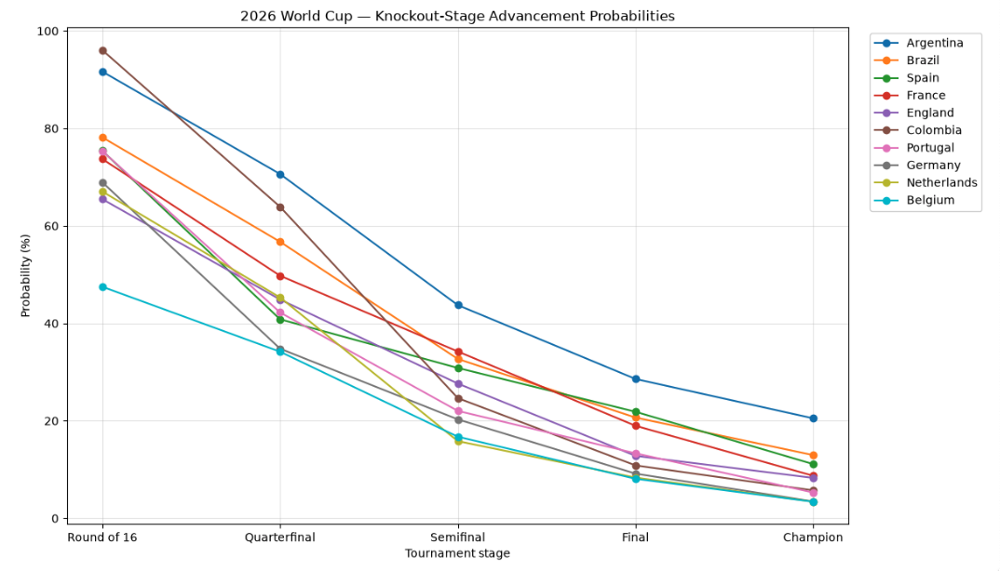
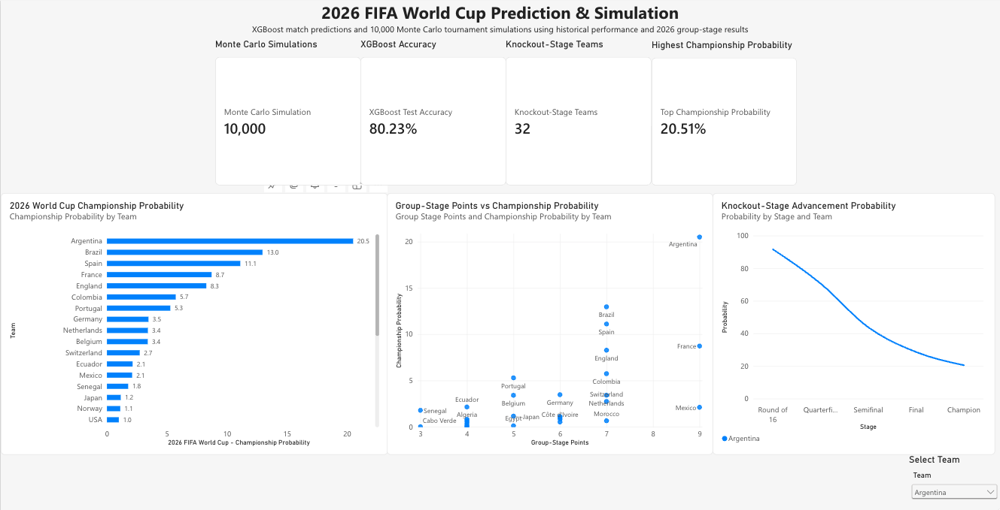

# 2026 FIFA World Cup Match Prediction & Tournament Simulation


An end-to-end data science project that uses historical international football data to predict 2026 FIFA World Cup knockout-stage match outcomes and estimate tournament advancement probabilities through Monte Carlo simulation.

The project combines **PostgreSQL/SQL, PySpark, Python, XGBoost, and Power BI** into a complete analytics and machine learning pipeline.

## Project Evolution

This project expands on an earlier FIFA World Cup prediction project by developing a complete end-to-end analytics pipeline.

The original project focused primarily on machine learning-based World Cup outcome prediction. This version extends that work by incorporating PostgreSQL/SQL data engineering, PySpark processing, chronological feature engineering, post-group-stage model updates, Monte Carlo tournament simulation, and Power BI visualization.

The result is a reproducible pipeline spanning database engineering, data processing, predictive modeling, simulation, and business intelligence.

## Key Results

| Metric | Result |
|---|---:|
| Historical matches analyzed | **7,395** |
| ML training dataset | **6,692 matches** |
| Decisive matches used for binary model | **5,130** |
| XGBoost test accuracy | **80.23%** |
| XGBoost test log loss | **0.4182** |
| Monte Carlo simulations | **10,000** |
| Teams reaching knockout stage | **32** |
| Unique simulated champions | **29** |

## Repository Contents

- [`world_cup_prediction_model.ipynb`](world_cup_prediction_model.ipynb) — complete Python machine learning and simulation workflow
- [`sql/`](sql/) — PostgreSQL schema, data ingestion, standardization, feature engineering, and ML dataset construction
- [`powerbi/`](powerbi/) — Power BI dashboard and supporting datasets
- [`images/`](images/) — project visualizations

## Project Overview

The goal of this project was to build a reproducible machine learning workflow that transforms historical international football data into match-level predictions and tournament-level simulations.

The pipeline combines:

**PostgreSQL → SQL Feature Engineering → PySpark → XGBoost → Match Probabilities → Monte Carlo Simulation → Power BI**

The historical dataset contains **7,395 international matches**. The final machine learning dataset contains **6,692 matches** after requiring five previous matches of available team history and applying a chronological data cutoff.

## Technologies

- **Python** — data analysis, machine learning, simulation
- **PostgreSQL / SQL** — relational data storage, data integration, feature engineering
- **PySpark** — data processing and analytical feature engineering
- **XGBoost** — binary match outcome prediction
- **pandas / NumPy** — data manipulation and numerical analysis
- **scikit-learn** — model evaluation and validation
- **Matplotlib** — visualization
- **Power BI** — interactive dashboarding
- **Jupyter Notebook / VS Code** — development environment

## Data Pipeline

## Data Sources

The project uses historical international football match data and FIFA ranking data.

The raw datasets are not included in the repository. Instead, the repository provides the SQL schema, ingestion workflow, data-standardization queries, feature-engineering logic, and model-training dataset construction needed to reproduce the analytical pipeline after obtaining the source data.

### Data Processing

Raw match data
→ PostgreSQL staging tables
→ Standardized team names
→ FIFA ranking integration
→ Historical feature engineering
→ Chronological model dataset
→ XGBoost
→ Monte Carlo simulation
→ Power BI

### 1. PostgreSQL & SQL

Historical match results and FIFA ranking data were stored in a relational PostgreSQL database.

SQL was used to:

- Design relational database tables
- Load and validate source data
- Standardize team names across datasets
- Join match, ranking, recent-form, and head-to-head data
- Create rolling five-match team-form features
- Calculate head-to-head statistics
- Construct the final machine learning dataset
- Apply a temporal cutoff to prevent 2026 World Cup group-stage results from entering model training

The SQL implementation is available in the [`sql/`](sql/) directory.

### 2. PySpark

PySpark was used as a data-processing and analytical layer for the historical match data.

The Spark workflow:

- Loaded match data from PostgreSQL using JDBC
- Performed data-quality validation
- Created match-level analytical fields
- Transformed matches into team-level match records
- Calculated rolling five-match performance features
- Generated Power BI-ready datasets
- Processed 2026 group-stage and team-performance data

### 3. Feature Engineering

The final model used 12 features:

- FIFA ranking difference
- FIFA points difference
- Neutral venue indicator
- Home recent five-match win rate
- Away recent five-match win rate
- Home recent five-match goal difference
- Away recent five-match goal difference
- Previous head-to-head matches
- Home head-to-head win rate
- Away head-to-head win rate
- Head-to-head history indicator
- Head-to-head win-rate difference

Recent-form and head-to-head features were constructed using information available before the match being predicted.

## Model Development

Several classification approaches were evaluated during development:

- Logistic Regression
- Random Forest
- Multiclass XGBoost
- Binary XGBoost

Because knockout-stage matches require a winner, the final model was developed as a **binary XGBoost classifier using historical decisive matches**, with draws excluded before the chronological train/test split.

### Final XGBoost Performance

| Metric | Held-Out Test Set |
|---|---:|
| Accuracy | **80.23%** |
| Log Loss | **0.4182** |
| Brier Score | **0.1357** |

The final test set contained **966 decisive matches** from January 2025 through June 10, 2026.

A chronological split was used rather than a random split so that future matches were not used to train the model evaluated on earlier data.

## 2026 World Cup Knockout-Stage Analysis

After the 2026 group stage concluded, the project incorporated the completed group-stage results into each team's recent-form features.

Each team's latest five matches were recalculated using results through **June 27, 2026**.

The updated features were then used to generate model-based win probabilities for the actual Round of 32 matchups.

This allowed the knockout-stage predictions to incorporate current tournament form without changing the historical model-training dataset.

## Monte Carlo Tournament Simulation

The model's matchup probabilities were used to simulate the entire knockout stage **10,000 times**.

Each simulation:

1. Simulates the Round of 32
2. Advances the winners to the Round of 16
3. Simulates the quarterfinals
4. Simulates the semifinals
5. Simulates the championship match
6. Records each team's advancement stage and championship result

The simulation was validated to ensure that every tournament produced:

- 16 Round of 32 winners
- 8 quarterfinalists
- 4 semifinalists
- 2 finalists
- 1 champion

Across the 10,000 simulations, **29 different teams** were observed winning the simulated tournament.

The simulation results provide estimated advancement frequencies rather than guaranteed tournament outcomes.

## Visualizations

The project includes visualizations showing:

- Championship probability
- Knockout-stage advancement probabilities
- Team performance
- Changes in model probabilities after the group stage

### Championship Probability

The Monte Carlo simulation estimates the frequency with which each team won the simulated tournament across 10,000 tournament scenarios.



### Knockout-Stage Advancement

The simulation also estimates how frequently teams advanced through each knockout stage.



### Power BI Dashboard

The Power BI dashboard brings together the model predictions, group-stage performance, and Monte Carlo simulation results into an interactive analytical view.



## Power BI

Power BI was used to create a business-facing visualization layer for the project.

Power BI-ready datasets were generated for:

- 2026 group-stage team performance
- 2026 recent team form
- Historical team performance
- Monte Carlo advancement probabilities
- Combined 2026 team analysis

The Power BI dashboard presents the machine learning and simulation results through interactive visualizations.

## Limitations

The model produces probabilities rather than guaranteed outcomes.

The prediction system does not explicitly incorporate factors such as:

* Injuries
* Player availability
* Starting lineups
* Tactical changes
* Match-specific circumstances

The Monte Carlo simulation assumes that the model’s estimated matchup probabilities are appropriate for the simulated knockout matches.

## What This Project Demonstrates

This project demonstrates an end-to-end data science workflow:

SQL → Data Engineering → Feature Engineering → Machine Learning → Model Evaluation → Probability Modeling → Monte Carlo Simulation → Business Intelligence

The project emphasizes:

* Reproducible data processing
* SQL and relational data modeling
* Chronological model validation
* Data leakage prevention
* Feature engineering
* Predictive probability modeling
* Monte Carlo simulation
* Data visualization
* Translating machine learning results into a business-facing dashboard

## Project Structure

```text
World-Cup-Prediction-Full-Pipeline/
│
├── sql/
│   ├── 01_database_schema.sql
│   ├── 02_data_ingestion.sql
│   ├── 03_data_standardization.sql
│   ├── 04_feature_engineering.sql
│   └── 05_model_training_dataset.sql
│
├── powerbi/
│   └── Power BI dashboard files
│
├── data/
│   └── Project datasets
│
├── world_cup_prediction_model.ipynb
│
└── README.md

